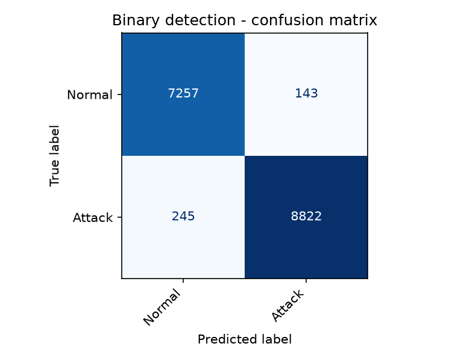
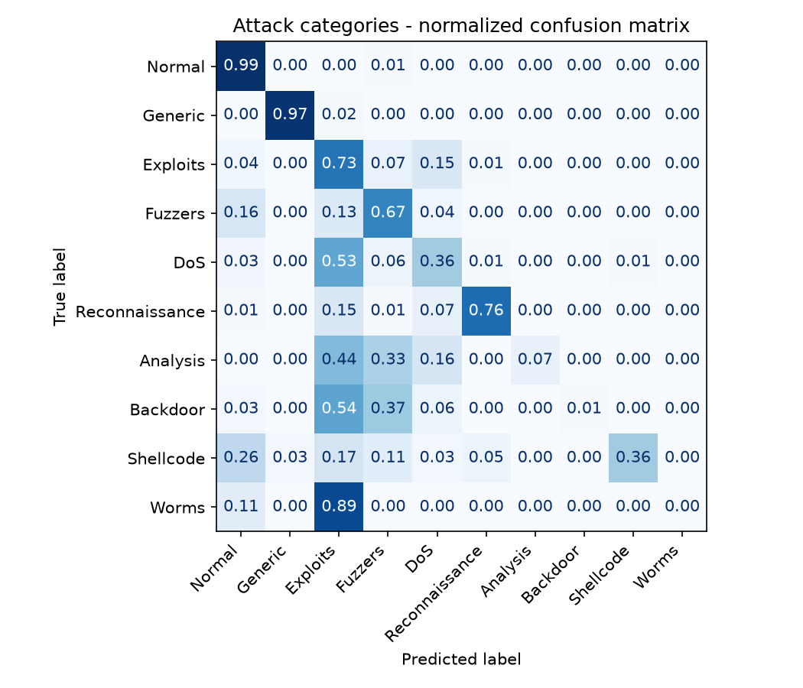
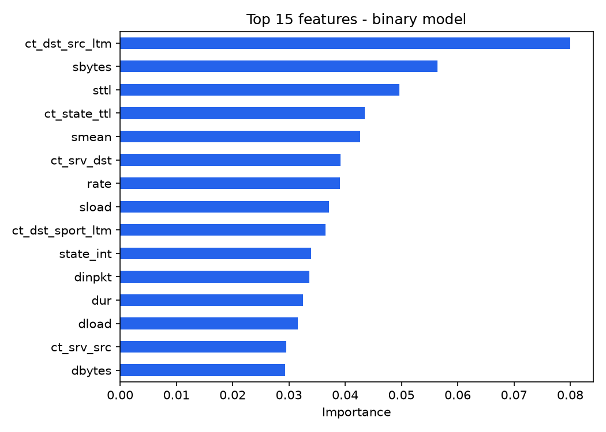
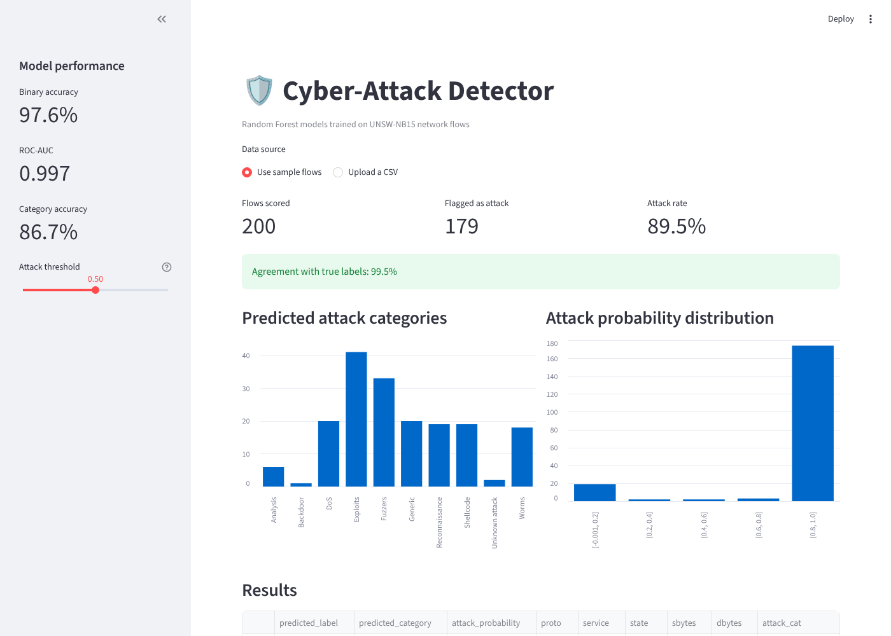

# :shield: Cyber-Attack Detection with Machine Learning

Random Forest models that detect malicious network traffic and classify the type of attack, trained on the **UNSW-NB15** intrusion detection dataset.


---

## :dart: What it does

| Task | Question | Model |
| --- | --- | --- |
| **Binary detection** | Is this network flow normal or an attack? | Random Forest (300 trees) |
| **Attack categorization** | Which of 9 attack types (or normal) is it? | Random Forest (300 trees) |

---

## :bar_chart: Results

Evaluated on a stratified 20% hold-out set (16,467 flows).

### Binary detection

| Accuracy | Precision | Recall | F1 | ROC-AUC |
| --- | --- | --- | --- | --- |
| **97.6%** | 98.4% | 97.3% | 97.8% | **0.997** |

<p align="center"></p>

### Attack categorization (10 classes)

| Accuracy | Weighted F1 | Macro F1 |
| --- | --- | --- |
| **86.7%** | 0.861 | 0.510 |

| Category | F1 | | Category | F1 |
| --- | --- | --- | --- | --- |
| Generic | 0.98 | | Fuzzers | 0.68 |
| Normal | 0.97 | | Shellcode | 0.43 |
| Reconnaissance | 0.83 | | DoS | 0.37 |
| Exploits | 0.68 | | Analysis / Backdoor / Worms | < 0.15 |

<p align="center"></p>

Common, high-volume attacks are recognised well. Rare classes (Worms has only 44 samples in the whole dataset) are mostly confused with **Exploits**, since their flow statistics look similar.

### What drives the predictions

<p align="center"></p>

Connection-count features (`ct_dst_src_ltm`, `ct_state_ttl`), bytes sent (`sbytes`) and time-to-live (`sttl`) are the strongest signals.

---

## :warning: Avoiding label leakage

An earlier version of this project reported **100% accuracy**. The cause was leakage, not a perfect model:

| Feature set | Accuracy |
| --- | --- |
| Includes `attack_cat` | 100.0% - `attack_cat == "Normal"` *is* the label |
| Includes `id` | 99.8% - row IDs are ordered by class |
| **Clean (both removed)** | **97.6%** |

Both columns are now excluded, and the notebook demonstrates the difference step by step.

---

## :desktop_computer: Web app

<p align="center"></p>

A Streamlit app scores a CSV of network flows (or the bundled sample), flags attacks with an adjustable probability threshold, names the attack type, and lets you download the results.

---

## :file_folder: Project structure

```
Cyber-Attack-Detection/
├── app.py                           # Streamlit web app
├── src/
│   ├── config.py                    # paths and constants
│   ├── data.py                      # loading, cleaning, input validation
│   ├── model.py                     # pipeline definition, save/load
│   ├── train.py                     # trains, evaluates and saves both models
│   └── predict.py                   # scores new flows from the command line
├── notebooks/
│   └── cyber_attack_detection.ipynb # walkthrough incl. the leakage demo
├── examples/
│   └── sample_flows.csv             # 200 labelled flows (20 per category) for demos and tests
├── tests/
│   └── test_pipeline.py             # end-to-end smoke tests
├── reports/
│   ├── figures/                     # charts used in this README
│   └── metrics.json                 # scores from the last training run
├── data/README.md                   # how to download UNSW-NB15
├── models/                          # created by training (git-ignored)
├── requirements.txt
└── LICENSE
```

---

## :rocket: Run it yourself

```bash
git clone https://github.com/AiMk937/Cyber-Attack-Detection.git
cd Cyber-Attack-Detection
python3 -m venv .venv && source .venv/bin/activate
pip install -r requirements.txt
```

Download `UNSW_NB15_training-set.csv` into `data/` (see [data/README.md](data/README.md)), then:

| Step | Command |
| --- | --- |
| Train and save both models (~2-3 min) | `python -m src.train` |
| Up-weight rare attack types | `python -m src.train --class-weight balanced` |
| Score a CSV of flows | `python -m src.predict examples/sample_flows.csv` |
| Use a stricter attack threshold | `python -m src.predict flows.csv --threshold 0.8 --output results.csv` |
| Launch the web app | `streamlit run app.py` |
| Run the tests | `pytest -q` |

Training writes the models to `models/`, scores to `reports/metrics.json`, and charts to `reports/figures/`.

> The sample flows come from the same dataset the model was trained on, so agreement on them is higher than on truly unseen data. The hold-out scores above are the honest measure.

---

## :crystal_ball: Next steps

- Handle class imbalance with class weights or SMOTE to lift rare-attack recall
- Compare against gradient boosting (XGBoost / LightGBM)
- Test generalisation on the second official UNSW-NB15 partition instead of a random split

---

## :books: Dataset

Moustafa, N. and Slay, J. "UNSW-NB15: a comprehensive data set for network intrusion detection systems." *MilCIS*, IEEE, 2015.

## :page_with_curl: License

[MIT](LICENSE) - Aimaan Khan
